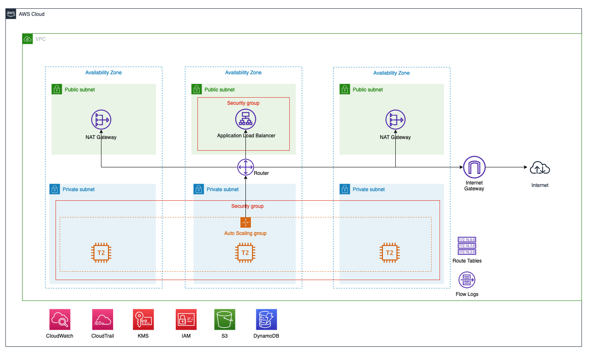
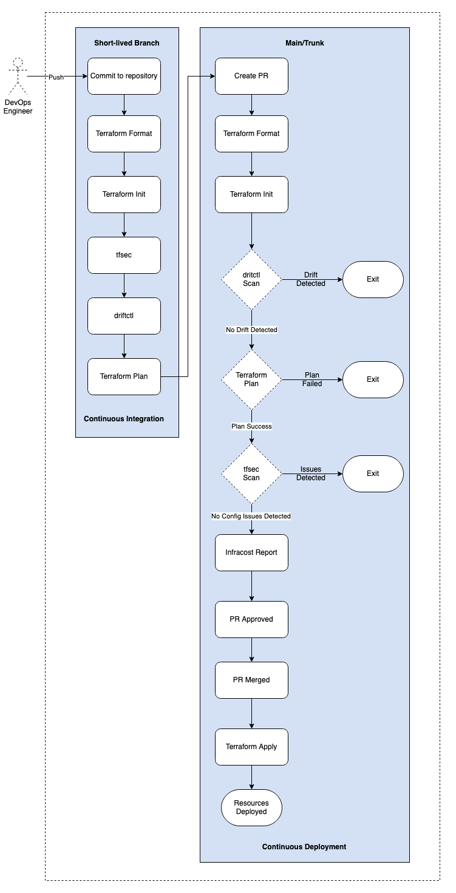
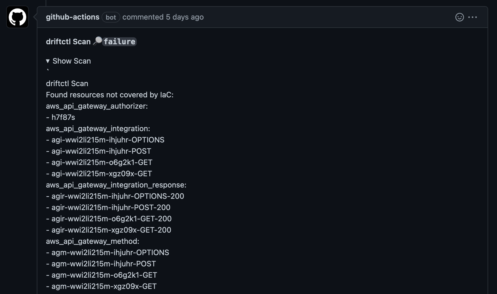
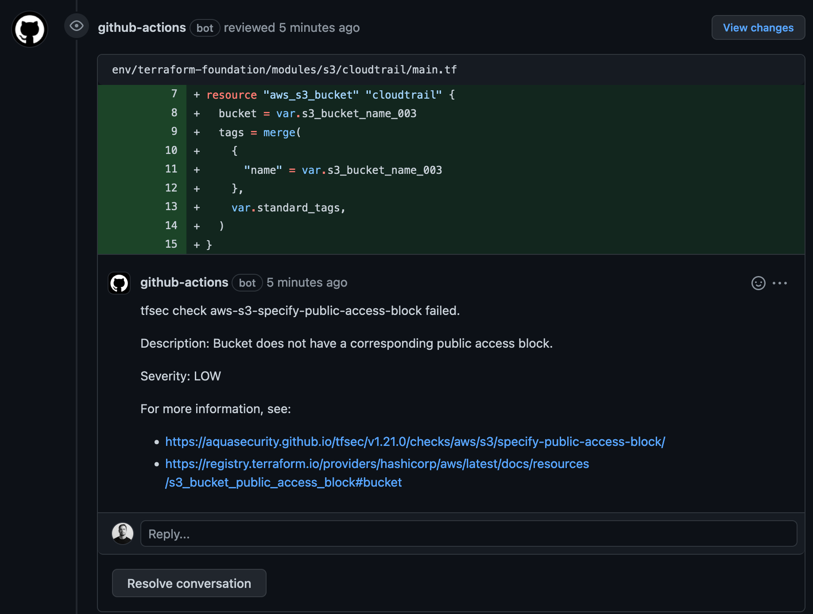
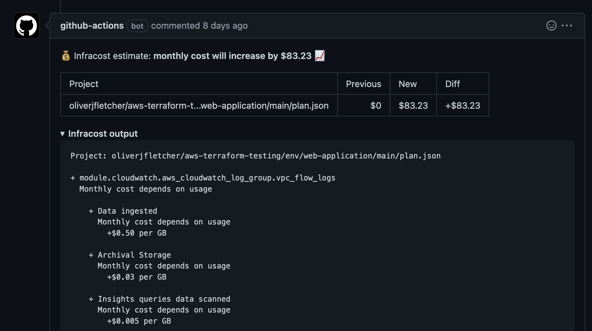

# AWS Terraform Demo

 This repository demonstrates an automated deployment of AWS services by using Terraform and GitHub Actions. There are two distinct services defined. The Terraform Foundation service deploys the foundational AWS services. The services defined support the deployment of the Web Application service. This includes the required identity, storage for Terraform state and audit logging service. CI and CD have also been integrated with a number of tools/tests to detect infrastructure drift, detect security risks pertaining to configuration, and estimate costs for AWS services.

## Change Log

|**Version**     |**Changes**                               |
|----------------|------------------------------------------|
|v0.01           |Initial commit with baseline requirements |
|v0.02           |Update of KMS and S3 Bucket Policy to enable encryption of CloudTrail logs, and GitHub Action workflow testing |
|v0.03           |Clean up directory structure and add Terraform workspace |
|v0.04           |Integrated driftctl into GH Actions workflow to detect drift |
|v0.05           |Adding tfsec to GH Actions workflow to scan Terraform for misconfigurations |

## CI/CD Status


## Table of Contents

- [AWS Terraform Demo](#aws-terraform-demo)
  - [Change Log](#change-log)
  - [CI/CD Status](#cicd-status)
  - [Table of Contents](#table-of-contents)
    - [Solution Architecture](#solution-architecture)
    - [AWS-Services](#aws-services)
      - [Terraform Foundation (AWS Services)](#terraform-foundation-aws-services)
      - [Web Application (AWS Services)](#web-application-aws-services)
    - [Terraform-Resources](#terraform-resources)
      - [Terraform Foundation (Terraform Resources)](#terraform-foundation-terraform-resources)
      - [Web Application (Terraform Resources)](#web-application-terraform-resources)
    - [Terraform-Taxonomy](#terraform-taxonomy)
      - [Taxonomy](#taxonomy)
    - [Terraform-Operations](#terraform-operations)
      - [Terraform State](#terraform-state)
      - [Terraform Variables](#terraform-variables)
      - [Terraform-Service-Account](#terraform-service-account)
    - [CI/CD](#cicd)
      - [GitHub Actions](#github-actions)
      - [CI/CD Pipeline](#cicd-pipeline)
      - [driftctl](#driftctl)
      - [tfsec](#tfsec)
      - [Secrets Management](#secrets-management)
      - [Infra-Cost](#infra-cost)
      - [Private Repository Hosting](#private-repository-hosting)
        - [Github Actions Workflow](#github-actions-workflow)
        - [Terraform Source](#terraform-source)

### Solution Architecture



### AWS-Services

#### Terraform Foundation (AWS Services)

- [CloudTrail](https://docs.aws.amazon.com/cloudtrail/index.html)
- [DynamoDB](https://docs.aws.amazon.com/amazondynamodb/latest/developerguide/Introduction.html)
- [IAM](https://docs.aws.amazon.com/IAM/latest/UserGuide/introduction.html)
- [Key Management Service](https://docs.aws.amazon.com/kms/latest/developerguide/overview.html)
- [S3](https://docs.aws.amazon.com/AmazonS3/latest/dev/Welcome.html)

#### Web Application (AWS Services)

- [Virtual Private Cloud](https://docs.aws.amazon.com/vpc/index.html)
- [Virtual Private Cloud Subnets](https://docs.aws.amazon.com/vpc/latest/userguide/VPC_Subnets.html)
- [Route Table](https://docs.aws.amazon.com/vpc/latest/userguide/VPC_Route_Tables.html)
- [Internet Gateway](https://docs.aws.amazon.com/vpc/latest/userguide/VPC_Internet_Gateway.html)
- [NAT Gateway](https://docs.aws.amazon.com/vpc/latest/userguide/vpc-nat-gateway.html)
- [Security Groups](https://docs.aws.amazon.com/vpc/latest/userguide/VPC_SecurityGroups.html)
- [ELB](https://docs.aws.amazon.com/elasticloadbalancing/latest/application/introduction.html)
- [EC2](https://docs.aws.amazon.com/ec2/index.html)
- [Auto Scaling](https://docs.aws.amazon.com/autoscaling/ec2/userguide/what-is-amazon-ec2-auto-scaling.html)
- [CloudWatch](https://aws.amazon.com/cloudwatch/getting-started/)
- [Key Management Service](https://docs.aws.amazon.com/kms/latest/developerguide/overview.html)
- [IAM](https://docs.aws.amazon.com/IAM/latest/UserGuide/introduction.html)

### Terraform-Resources

#### Terraform Foundation (Terraform Resources)

- [CloudTrail](https://registry.terraform.io/providers/hashicorp/aws/latest/docs/resources/cloudtrail)
- [DynamoDB](https://registry.terraform.io/providers/hashicorp/aws/latest/docs/resources/dynamodb_table)
- [IAM](https://registry.terraform.io/providers/hashicorp/aws/latest/docs/resources/iam_role)
- [Key Management Service](https://registry.terraform.io/providers/hashicorp/aws/latest/docs/resources/kms_key)
- [S3](https://registry.terraform.io/providers/hashicorp/aws/latest/docs/resources/s3_bucket)

#### Web Application (Terraform Resources)

- [Virtual Private Cloud](https://registry.terraform.io/providers/hashicorp/aws/latest/docs/resources/vpc)
- [Virtual Private Cloud Subnets](https://registry.terraform.io/providers/hashicorp/aws/latest/docs/resources/subnet)
- [Route Table](https://registry.terraform.io/providers/hashicorp/aws/latest/docs/resources/route_table)
- [Internet Gateway](https://registry.terraform.io/providers/hashicorp/aws/latest/docs/resources/internet_gateway)
- [NAT Gateway](https://registry.terraform.io/providers/hashicorp/aws/latest/docs/resources/nat_gateway)
- [Security Groups](https://registry.terraform.io/providers/hashicorp/aws/latest/docs/resources/security_group)
- [ELB](https://registry.terraform.io/providers/hashicorp/aws/latest/docs/resources/elb)
- [EC2](https://registry.terraform.io/providers/hashicorp/aws/latest/docs/resources/instance)
- [Auto Scaling](https://registry.terraform.io/providers/hashicorp/aws/latest/docs/resources/autoscaling_group)
- [CloudWatch](https://registry.terraform.io/providers/hashicorp/aws/latest/docs/resources/cloudwatch_log_group)
- [IAM](https://registry.terraform.io/providers/hashicorp/aws/latest/docs/resources/iam_role)
- [Key Management Service](https://registry.terraform.io/providers/hashicorp/aws/latest/docs/resources/kms_key)

### Terraform-Taxonomy

Below outlines the Terraform taxonomy and how environments, services and resources folders have been structured. Each environment for each service is separated into it's Terraform tfvars file to enable independent management and state of each environment. Each of the environments will also be deployed into it's own Terraform Workspace.

Each service deployed will be segregated into it's own folder so that state and configuration can be managed separately. There are instances where services will also be further segregated into sub-services. The main folder will house the main.tf, variables.tf and the tfvars file for resource and environment variables.

#### Taxonomy

```bash
.    
├── env
│   ├── service
│   │   └── sub-service
│   │       ├── main
│   │       │   │
│   │       │   ├── files
│   │       │   ├── main.tf
│   │       │   ├── outputs.tf
│   │       │   ├── dev.tfvars
│   │       │   └── variables.tf
│   │       └── modules
│   │           │
│   │           ├── service
│   │           └── service
│   ├── service
│   │   ├── main
│   │   │   ├── files
│   │   │   ├── main.tf
│   │   │   ├── outputs.tf
│   │   │   ├── dev.tfvars
│   │   │   └── variables.tf
│   │   │
│   │   └── modules
│   │       ├── service
│   │       └── service

```

### Terraform-Operations

#### Terraform State

Terraform [State](https://www.terraform.io/docs/state/index.html) for the Web Application solution has been configured to be stored within Amazon Web Services S3 buckets. The below table outlines the applicable bucket where the Terraform state is stored. The service account has also been provided s3 bucket read and write permission so it can manage the state file stored in the below buckets. The Terraform state has also been replicated between regions to ensure availability.

**Table 2.** *Terraform State S3 Buckets*

|**Bucket Name**  |**Service**     |**Environment** |**URL**           |**Region**        |
|-----------------|----------------|----------------|------------------|------------------|
|useds3b000       |Web Application |Dev             |[useds3b000](https://s3.console.aws.amazon.com/s3/buckets/useds3b000)| us-west-1
|useds3b001 |Web Application |Dev |[useds3b001](https://s3.console.aws.amazon.com/s3/buckets/useds3b001)| us-west-2

#### Terraform Variables

[tfvars](https://www.terraform.io/docs/configuration/variables.html#variable-definitions-tfvars-files) files have been defined to make configuration changes to AWS resources effectively without having to changes to multiple variables throughout templates. Each tfvars file is defined within the main folder within the service folder. Global variables will also be defined within the variables.tf file in the main folder. The Global variables file is used to define variables that are standard values across the environment or service, and by definition should not require regular or any change at all, such as; project, location etc.

#### Terraform-Service-Account

As Terraform will require access to the AWS Organization, a [IAM User](https://docs.aws.amazon.com/IAM/latest/UserGuide/id_users.html) has been provisioned to act as a service account for the provisioning of the AWS resources. The service account will be created in the Terraform Foundation AWS account and will be assigned the sts:AssumeRole action to enable the service account to provision services in the Web Application AWS account.

**Table 1.** *Terraform Service Account*

|**Service Account Name** |**Service**          |**Environment**        |
|-------------------------|---------------------|-----------------------|
|terraform                |Terraform Foundation |Development            |
|terraform                |Web Application      |Development            |

### CI/CD

#### GitHub Actions

[GitHub Actions](https://learn.hashicorp.com/tutorials/terraform/github-actions?in=terraform/automation) is leveraged to enable CI/CD and GitOps for the services that have been defined using Terraform modules. The GitHub Actions workflow runs the below Terraform commands during CI and CD to automate the lifecycle of the AWS services defined in the Terraform modules.

|**Command**      |**Description**                     |
|-----------------|------------------------------------|
|[terraform fmt](https://www.terraform.io/cli/commands/fmt)    |Run to lint the Terraform templates |
|[terraform init](https://www.terraform.io/cli/commands/init)   |Run to initialize a working directory |
|[terraform plan](https://www.terraform.io/cli/commands/plan)   |Run to output which resources will be deployed when terraform apply is run, the output is added as a comment to the PR|
|[terraform show](https://www.terraform.io/cli/commands/show)   |Run  to output the resources to json to be consumed by the Infra Cost API|
|[terraform apply](https://www.terraform.io/cli/commands/apply)  |Run to deploy the resources, once the PR has been approved and merged|
|[terraform destroy](https://www.terraform.io/cli/commands/destroy) |Run to destroy the resources, once the PR has been approved and merged|

#### CI/CD Pipeline



#### driftctl

[driftctl](https://docs.driftctl.com/) is integrated to the GitHub Actions workflow to enable GitOps with Terraform. The driftctl scan command will scan the current AWS account and detect drift by comparing what has been deployed in the AWS account to what is defined in the Terraform templates. The below screenshot details an example of the output that is created by driftctl.



#### tfsec

[tfsec](https://aquasecurity.github.io/tfsec/) is integrated to the GitHub Actions workflow to enable static security analysis of the Terraform templates to detect potential security risks. The tfsec scan will scan the Terraform templates and output a comment to the pull request. The comment details the location in the template of the security risk and the severity. It will also provide a link for the Terraform documentation so the risk can be remediate where required in future commits.



#### Secrets Management

The below outlines the GitHub secrets that have been defined. The AWS secrets enable GitHub Actions to run Terraform commands as the IAM user to manage the AWS resources throughout their lifecycle. To enable GitHub to interact with the Infra Cost API an API key is also stored in the GitHub secrets store. All of the secrets are called in the GitHub Actions workflow using environment variables.

**Table 2.** *GitHub Secrets*

|**Name**         |
|-----------------|
|AWS_ACCESS_KEY_ID|
|AWS_SECRET_ACCESS_KEY|
|INFRACOST_API_KEY|

#### Infra-Cost

The GitHub Actions workflow leverages the [Infracost](https://github.com/infracost/actions) GitHub action. This enables cost for the usage for the AWS resources provisioned to be estimated. The below screenshot details an example of the output that is created by Infracost.



#### Private Repository Hosting

If you intend to run your GitHub Actions workflow from a private GitHub repository you will need to ensure that you add your GitHub Actions token into the Git config for the runner. This will need to run in parallel with the Terraform init command. The source within your main.tf will also need to change to allow for SSH to the private repository to download the modules.

##### Github Actions Workflow

```bash
     - name: Terraform Init - Dev
        id: init
        run: |
          git config --global url."https://oauth2:${{ secrets.GITHUB_TOKEN }}@github.com".insteadOf ssh://git@github.com
          terraform init
        working-directory: "./env/web-application/main/"

```

##### Terraform Source

```bash
  module "vpc" {
    source               = "git@github.com:oliverjfletcher/aws-terraform-testing.git//env/web-application/modules/vpc"
    vpc_name             = var.vpc_name
    standard_tags        = var.standard_tags
    vpc_cidr             = var.vpc_cidr
    enable_dns_hostnames = var.enable_dns_hostnames
    enable_dns_support   = var.enable_dns_support
  }

```
